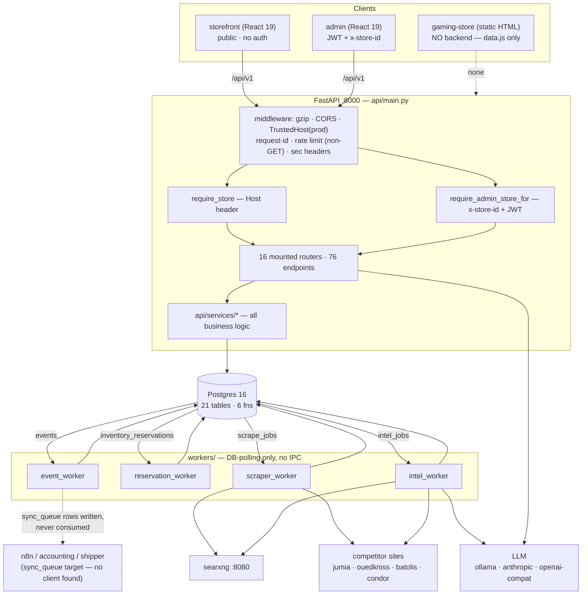

# GLstore — Architecture As-Built

**Audit date:** 2026-07-31 · **Branch:** `gaming-store` · **Tree:** clean at `760b8b7`
**Method:** every claim below was read from source. Findings are labelled **CONFIRMED** (I read the code and cite file:line) or **SUSPECTED** (inferred, not proven).
**Scope note:** this is a read-only audit. No source file was modified.

---

## 1. System purpose in plain language

GLstore is a **catalog-intelligence platform with an e-commerce front door**, built for the Algerian consumer-electronics market.

The business problem it solves is not "sell things online" — that part is comparatively small. It is: *a merchant receives messy supplier CSVs and scattered web data, and needs a clean, priced, image-complete, category-correct catalog they can actually sell from.* So the system has two halves of roughly equal weight:

- **The selling half** — a public catalog, a cart, and a COD-first checkout with wilaya/commune shipping in DZD. There are **no customer accounts**; a "customer" is created implicitly from a phone number at checkout (`db/schema.sql:178-186`) and orders are looked up publicly by `(order_number, phone)`.
- **The intelligence half** — CSV import, a deterministic rule enrichment engine, a four-tier web scraper (httpx → Playwright → stealth → paid), a self-hosted SearXNG search aggregator, and an LLM merge pipeline that fills in brand/category/description/specs and queues scraped images for human review.

Who it is for: a small merchant/operator team (roles `SUPER_ADMIN`, `ADMIN`, `OPERATOR`, `VIEWER`) running one or more storefront brands off one platform. As of migration 005 the platform is **multi-tenant** ("superstore"): N isolated store catalogs, routed by `Host` header.

---

## 2. The real architecture as-built

### 2.1 What actually exists

| Component | Path | Reality |
|---|---|---|
| FastAPI API | `api/` | 17 route modules, **16 mounted** (`api/main.py:19,174-193`), 76 route decorators total |
| Postgres 16 | `db/` | 13 base tables + 8 added by migrations = **21 tables**, plus 6 stored functions |
| event_worker | `workers/event_worker.py` | `events` → `sync_queue` fan-out to `n8n` |
| reservation_worker | `workers/reservation_worker.py` | expire holds (30s) + prune observations (daily) |
| scraper_worker | `workers/scraper_worker.py` | claims `scrape_jobs` |
| intel_worker | `workers/intel_worker.py` | claims `intel_jobs`, runs `full_intel` |
| SearXNG | compose service | search aggregator, intra-net `searxng:8080`, host `:8088` |
| storefront | `storefront/` | React 19 + Vite, **the only real customer surface** |
| admin | `admin/` | React 19 + Vite, 14 pages, JWT |
| gaming-store | `gaming-store/` | 8 static HTML pages + 961 lines of vanilla JS. **Zero API calls — CONFIRMED** |

**CONFIRMED — `gaming-store/` makes no network calls.** A repo-wide grep for `fetch(` / `/api/` across `gaming-store/assets/js/*.js` and all 8 HTML files returns exactly one hit: `gaming-store/assets/js/app.js:641`, which is *prose inside a mock checkout page* reading "In the real platform this posts to `POST /api/v1/orders/create`". All product data is the 176-line hardcoded array in `gaming-store/assets/js/data.js`. It is a design study, not a surface.

### 2.2 Responsibilities and boundaries

**The API is a thin SQL-over-HTTP layer, not a domain model.** There is no ORM model layer — `api/models/` contains exactly one file, `schemas.py` (Pydantic DTOs). Every query is raw SQL via `sqlalchemy.text()`. This is a deliberate, consistent choice, and it is the single most important thing to know before touching this codebase: *there is no mapper to protect you from a schema change.* The four already-fixed `store_id` NOT-NULL bugs are the direct consequence — adding a NOT NULL column has no compile-time or model-time consequence anywhere, only a runtime one.

**Business logic lives in `api/services/`, not in routes.** Routes do auth + store resolution + parameter binding, then delegate. `api/services/orders.py` is the clearest example: routes in `api/routes/orders.py` are 5–10 lines each and the whole order lifecycle is in the service.

**Workers own no logic they don't share with the API.** `workers/intel_worker.py` is pure lifecycle management (claim / heartbeat / mark complete / stale sweep); the actual pipeline is `api/services/full_intel.py`, imported *from the API package*. Same for `scraper_worker` → `api/services/scraper/engine.py`. Workers are schedulers wrapped around API services.

**Coordination is exclusively through database rows.** No queue broker, no Redis, no worker-to-worker channel. Claims use `UPDATE … WHERE id IN (SELECT … FOR UPDATE SKIP LOCKED LIMIT n)` uniformly (`workers/event_worker.py:107-129`, `workers/intel_worker.py:48-62`, `workers/scraper_worker.py:46-61`).

### 2.3 The multi-store boundary — two different resolvers

This is the newest and most load-bearing abstraction, and it is **asymmetric by design** (`api/core/store_context.py:15-22`):

- **Public routes** → `require_store` (`store_context.py:168`). Resolves the store from the `Host` header via `store_domains`, 60s cached. Host is client-controlled, so this is treated as a *routing* signal only.
- **Admin routes** → `require_admin_store_for(admin_dep)` (`store_context.py:235`). Deliberately ignores `Host`. A store-scoped operator gets their own `admin_users.store_id`; a platform operator (`store_id IS NULL`) **must** name a store via the `x-store-id` header.

Both bind into a `ContextVar` so `bound_store()` works anywhere in the request's async context, including the response-header stamp `x-store` in `api/main.py:140-142`.

The design is sound. The application of it is not uniform — see §6 and §7.

### 2.4 Two deployment shapes

| | Docker Compose | Vercel serverless |
|---|---|---|
| Definition | `docker-compose.yml` | `vercel.json`, `api/index.py` |
| DB | local Postgres 16 | Neon (`DB_SERVERLESS=true` → `NullPool`, `statement_cache_size=0`, `api/core/db.py:18-30`) |
| Migrations | API lifespan, advisory-locked (`api/main.py:50-66`) | pre-applied once by `scripts/deploy/init_remote_db.py`; `RUN_STARTUP_MIGRATIONS=false` |
| Store resolution | `Host` → `store_domains` (localhost seeded by `005_stores.sql:87-95`) | `SINGLE_STORE_MODE=true` → always the `default` store |
| Frontends shipped | none (run locally) | **storefront only** |
| Workers | 4 containers | **none** |

**CONFIRMED — the Vercel path ships no workers and no admin app.** `vercel.json` declares exactly two builds: `storefront/package.json` and `api/index.py`. Consequences on Vercel: reservations never expire (nothing calls `fn_expire_stale_reservations`), `events` rows never drain to `sync_queue`, and scrape/intel jobs queue forever. The admin dashboard has no deployment path at all.

---

## 3. Runtime topology



**CONFIRMED — `sync_queue` has a writer but no reader.** `workers/event_worker.py:42,59,76` insert rows with `target_system='n8n'` and `status='PENDING'`. A repo-wide grep finds no code that ever selects `sync_queue` rows to push them anywhere; `api/routes/jobs.py` only *reads* them for a status console. The outbound integration is a stub.

---

## 4. Critical paths — actual file order

### (a) Customer: browse → cart → checkout → order

| # | Step | File(s) in call order |
|---|---|---|
| 1 | Theme bootstrap | `storefront/src/lib/theme.ts:372` → `GET /api/v1/storefront/theme` → `api/routes/settings.py:349` → `app_settings['storefront.theme']` |
| 2 | Home / facets | `storefront/src/pages/Home.tsx` → `lib/api.ts:100-110` → `api/routes/catalog.py:28,47,66,274` (`require_store`) |
| 3 | Catalog list | `pages/Catalog.tsx` → `lib/api.ts:112` → `api/routes/products.py:70` `list_products` (`require_store`, `products.py:83`) |
| 4 | Product detail | `pages/ProductDetail.tsx` → `lib/api.ts:121` → `api/routes/products.py:181` (`require_store`) |
| 5 | Cart (client) | `storefront/src/lib/cart.tsx` — localStorage, no server state |
| 6 | Cart re-validate | `pages/Cart.tsx` → `lib/api.ts:197` → `POST /offers/availability` → `api/routes/public_orders.py:30` (scoped `o.store_id = :sid`, line 60) |
| 7 | Checkout submit | `pages/Checkout.tsx` → `lib/api.ts:175` → `POST /orders/create` → `api/routes/orders.py:20` (`require_store`) |
| 8 | Order creation | `api/services/orders.py:70` `create_order` — idempotency check (:72) → `_upsert_customer` (:22) → `_next_order_number` (:54) → offer load `FOR UPDATE` scoped to store (:89-102) → `INSERT orders` (:128) → per item `INSERT order_items` (:162) + `SELECT fn_reserve_stock(...)` (:181) → `UPDATE status='RESERVED'` (:190) → `emit_event('order.created')` (:195) |
| 9 | Stock hold | `db/migrations/006_store_scope_orders.sql:17` `fn_reserve_stock` — row-locks the offer, derives `store_id` from it, inserts `inventory_reservations` |
| 10 | Commit + confirm page | `api/routes/orders.py:32` `db.commit()` → `pages/OrderConfirmation.tsx` |
| 11 | Async fan-out | `workers/event_worker.py:107` claim → `:37` `handle_order_created` → `INSERT sync_queue` (dead end, see §3) |
| 12 | TTL release | `workers/reservation_worker.py:34` every 30s → `fn_expire_stale_reservations` (`db/schema.sql:559`) → `fn_release_reservation` (`:531`) |
| 13 | Tracking | `pages/OrderTracking.tsx` → `POST /orders/track` → `api/routes/public_orders.py:128` (scoped, constant-shape 404 at `:122`) |

Notes: order status stops at `RESERVED`. Nothing moves it to `CONFIRMED` except an admin call. **No row is ever written to `financial_transactions`** — see §7.6.

### (b) Admin: catalog management

| # | Step | File(s) |
|---|---|---|
| 1 | Login | `admin/src/pages/Login.tsx` → `lib/auth.tsx` → `POST /api/v1/auth/login` → `api/routes/auth.py` (per-account lockout via `admin_users.failed_attempts/locked_until`; per-IP tracker `auth.py:34-80`) |
| 2 | JWT | `api/core/security.py:30` `create_access_token` — carries `store_id` (`security.py:75-81`) |
| 3 | Store picker | `admin/src/lib/store.tsx` → `GET /stores` → `api/routes/stores.py:52`; selection persisted to `localStorage['gl.admin.store_id']` (`admin/src/lib/api.ts:16-22`) and injected as `x-store-id` on **every** request (`api.ts:37-38, 74-75`) |
| 4 | Product list | `pages/Products.tsx` → `GET /products` → `api/routes/products.py:70` — **resolves store from `Host`, ignores `x-store-id`** ⚠️ |
| 5 | Product detail | `pages/ProductDetail.tsx` → `GET /products/{id}` → `products.py:181` — **also Host-scoped** ⚠️ |
| 6 | Create / edit | `pages/ProductEditor.tsx` → `POST /products` (`products.py:257`) / `PATCH /products/{id}` (`:308`) — `require_admin_store_for`, i.e. `x-store-id` ⚠️ mismatch with 4–5 |
| 7 | Offers | `products.py:437,456,500` — `require_admin_store_for` |
| 8 | CSV import | `pages/ProductImport.tsx` → `api/routes/products_import.py` → `api/services/csv_parser.py` → `api/services/csv_import.py:256,302` (both carry `store_id`) |
| 9 | Image review | `pages/ImageReview.tsx` → `api/routes/images.py:49,105,171,213,258` — all 5 correctly `require_admin_store_for` |
| 10 | Issues | `pages/IssueExplorer.tsx` → `api/routes/issues.py` (store-scoped) |
| 11 | Graph | `pages/CatalogGraph.tsx` → `GET /products/graph` → `api/routes/catalog.py:87` — **Host-scoped** ⚠️ |
| 12 | Orders | `pages/Orders.tsx`, `OrderDetail.tsx` → `api/routes/orders.py:36,47,59,68` — `require_admin_store_for` ✅ |
| 13 | Settings | `pages/Settings.tsx`, `ThemeStudio.tsx` → `api/routes/settings.py` — **globally scoped, no store dependency at all** ⚠️ |

### (c) The scrape → intel → enrich pipeline

Three overlapping paths share the same scraper core. Knowing which is which matters:

**c1 — Rule-based enrichment (no network).**
`api/routes/enrichment.py:40,54` → `api/services/enrichment_runner.py` → `api/services/enrichment.py` (deterministic rules) → observation write `enrichment_runner.py:91` (derives `store_id` from the product — the correct pattern).

**c2 — Scrape only.**
`api/routes/scraper.py:47` `enqueue_scrape` → `INSERT scrape_jobs` (`:79`) → `workers/scraper_worker.py:46` claim → `api/services/scraper/engine.py:151` `run_job`:
`search.py` (SearXNG/DDG) → `ranker.py` → `fetcher.py` → tier cascade `tiers/tier1_http.py` → `tier2_playwright.py` → `tier3_stealth.py` / `tier3_5_patchright.py` → `tier4_paid.py` → per-retailer adapters `retailers/{jumia,ouedkniss,batolis,condor,facebook,midtier}.py` → extractors `extractors/*.py` → validators `validators/{normalization,price_validator}.py` → persist `engine.py:351` `_persist_sources` (`scrape_sources`) and `:386` `_persist_price` (`competitor_prices`) → `workers/scraper_worker.py:100` `_mark_complete`.

**c3 — Full intel (scrape + LLM merge).**
`api/routes/intel.py:37` (single) / `:114` (bulk) → `INSERT intel_jobs` → `workers/intel_worker.py:47` claim → `:92` `_mark_running` + heartbeat `:143` → `api/services/full_intel.py`:
`load_target` → **`INSERT scrape_jobs` shadow row + immediate `db.commit()` (`full_intel.py:437-466`)** → `scraper_engine.ScraperEngine.run_job` → `build_markdown_bundle` → `api/services/llm.py` `chat(json_mode=True)` → `apply_payload` (tiered merge: brand/category fill-only, description always, specs per-key, images appended as `PENDING`) → `INSERT product_media` (`:315`, derives `store_id`) → `INSERT observations` (`:344`, derives `store_id`) → status auto-bump → `workers/intel_worker.py:102` `_mark_complete` (updates **`intel_jobs`**, never the shadow `scrape_jobs` row).

**c4 — LLM enrichment without scraping.**
`api/routes/enrichment.py:99,116` → `api/services/llm_enrichment.py` → observation write `:133`.

---

## 5. Data model overview

### 5.1 The spine

| Table | Purpose | `store_id`? |
|---|---|---|
| `products` | canonical SKU family. `specs JSONB`, `completeness_score`, 7-state `product_status_enum` | **NOT NULL** |
| `offers` | sellable variant + inventory. `stock_quantity`, `reserved_quantity`, CHECK `reserved <= stock` | **NOT NULL** |
| `orders` | COD-first order header. CHECK `total = subtotal + shipping + tax − discount` | **NOT NULL** |
| `order_items` | immutable price snapshot. CHECK `line_total = unit_price * quantity` | **NOT NULL** |
| `customers` | implicit, phone-keyed, no login | **NOT NULL** |
| `admin_users` | the *only* accounts. bcrypt, 4 roles | **NULLABLE** — NULL = platform operator |
| `events` | idempotent event queue (`event_id UNIQUE`), retry + backoff | **NOT NULL** |
| `observations` | fact-level audit: "source X said field Y = Z at time T" | **NOT NULL** |
| `inventory_reservations` | TTL stock holds | **NOT NULL** |
| `stores` / `store_domains` | tenant + Host routing | (is the tenant) |

### 5.2 Everything else

`product_media` (NOT NULL store_id) · `sync_queue` (NOT NULL) · `financial_transactions` (NOT NULL) · `audit_log` (nullable) · `app_settings` (global k/v, **not scoped**) · `scrape_jobs`, `scrape_sources`, `competitor_prices`, `scrape_domain_state`, `intel_jobs` (**deliberately unscoped** — `005_stores.sql:11-14`) · `_migrations`.

### 5.3 Where store scoping applies — the exact rule

**11 tables have `store_id NOT NULL`** (`005_stores.sql:150-160`): `products`, `offers`, `product_media`, `observations`, `customers`, `orders`, `order_items`, `inventory_reservations`, `financial_transactions`, `events`, `sync_queue`.
**2 are nullable on purpose**: `admin_users`, `audit_log`.
**5 are unscoped by design**: the scraper/intel queue tables — the rationale in `005_stores.sql:11-14` is that the scraper researches *the market*, not one store's catalog.

Migration 005 also re-scoped every global uniqueness constraint to composite `(store_id, …)`: `products.sku`, `products.slug`, `offers.variant_sku`, `customers.phone_normalized`, `orders.order_number`, `orders.idempotency_key` (partial, NULL-tolerant) — `005_stores.sql:171-187`. `admin_users.email` stays globally unique on purpose (it is the login identity).

### 5.4 The two working `store_id` patterns

1. **Pass it in** — the caller already has a `Store`: `api/services/orders.py` threads `store.id` into every INSERT.
2. **Derive from parent** — the entity's owner determines the store, so join to it in the INSERT:
   ```sql
   INSERT INTO observations (store_id, entity_type, …)
   SELECT p.store_id, 'product', … FROM products p WHERE p.id = :pid
   ```
   Used at `enrichment_runner.py:91`, `llm_enrichment.py:133`, `full_intel.py:315,344`, and inside `fn_reserve_stock` (`006_store_scope_orders.sql:34-58`).

**Any new INSERT into one of the 11 tables must use pattern 1 or 2. There is no third option and nothing will warn you.**

---

## 6. Architecture drift — implementation vs. CLAUDE.md / docs

| # | Doc says | Reality | Evidence |
|---|---|---|---|
| D1 | CLAUDE.md §5: "**18 route modules**", table lists 16 | 17 files exist; **16 mounted**; `stores.py` (a whole new router, 2 endpoints) is **missing from the table entirely** | `ls api/routes/*.py` = 17; `api/main.py:19` imports 16 modules; `stores.py` mounted at `main.py:192` |
| D2 | CLAUDE.md §6: "Database — **13 tables**" | **21 tables**. 13 in `schema.sql`, +4 from `002_scraper`, +1 from `004_intel_jobs`, +2 from `005_stores`, +1 `_migrations` | `db/schema.sql` + `db/migrations/*.sql` |
| D3 | CLAUDE.md §4: diagram has no multi-store concept | Host-based tenancy is now the *first* thing every request does | `api/core/store_context.py`, `api/main.py:140-142` |
| D4 | CLAUDE.md §6: `financial_transactions` described as live ("PAYMENT / REFUND / ADJUSTMENT / COD_COLLECTION, idempotent on key") | **Zero code references anywhere.** Table is never written or read | repo-wide grep: only `CLAUDE.md`, `db/schema.sql`, `005_stores.sql`, `docs/*.md` |
| D5 | CLAUDE.md §9.2: shadow `scrape_jobs` rows are "unclear if cleaned up… risk: queue stats pollution" | Materially worse: they are **never** cleaned up and `scraper_worker` **will claim them and re-run the whole scrape** | `full_intel.py:437-466` inserts PENDING + commits; no `UPDATE scrape_jobs` exists in `full_intel.py` or `engine.py`; `scraper_worker.py:46-61` claims any PENDING |
| D6 | CLAUDE.md §3: "Backend, workers, DB schema… **100% identical** between branches" | Unverifiable from this branch and now stale — 6 commits of backend-only work (migrations 005/006, `store_context.py`, `stores.py`, Vercel path) landed on `gaming-store` after the anchor was written | commits `48a1b79..760b8b7` |
| D7 | `docs/` (10 files) predate the anchor, which predates multi-store | All of `docs/ARCHITECTURE*.md`, `SYSTEM_CONTEXT.md`, `API.md`, `STRUCTURE.md` describe a single-tenant system | e.g. `docs/ARCHITECTURE.md` still lists `financial_transactions` as part of the money flow |
| D8 | `README.md` — product is "Ghir Laffaire", ASCII diagram shows admin + API + 2 workers | 3 frontends, 4 workers, multi-store, GLAIVE. README never mentions `gaming-store`, GLAIVE, stores, or the intel/scraper workers | `README.md:1-30, 132` ("product is *Ghir Laffaire*") |
| D9 | `DEPLOY.md` step 5 curl uses `"address"` | Schema requires `"street"` — a copy-paste of the documented curl **422s** | `DEPLOY.md:137` vs `api/models/schemas.py:108-112`. The automated `scripts/deploy/smoke_test_checkout.py:151` correctly uses `street`, so only the human-facing doc is wrong |
| D10 | CLAUDE.md §7 env list | Missing 5 settings that now exist and change behaviour: `db_serverless`, `run_startup_migrations`, `single_store_mode`, `allowed_hosts`, `environment` | `api/core/config.py:22-36` |
| D11 | Implied: `stores.theme` drives per-store branding (`005_stores.sql:36-38`: "a new brand needs no redeploy") | Theme is read from the **global** `app_settings` key; `stores.theme` is returned by `/stores` and rendered by nothing | `api/routes/settings.py:349-359`; `stores.py:34`; `storefront/src/lib/theme.ts:372` |

---

## 7. Structural risks, ranked

### 7.1 CRITICAL — Cross-tenant write via unscoped intel/scrape enqueue

**CONFIRMED.** `api/routes/intel.py:48` and `api/routes/scraper.py:60-62` both validate the target product with:

```sql
SELECT 1 FROM products WHERE id = :id
```

No `store_id` predicate. Neither module imports `store_context` at all (`grep` for store deps: `intel.py` = 0, `scraper.py` = 0). Both endpoints are gated only by `require_role(*WRITE_ROLES)` — which any `OPERATOR` of *any* store holds.

An operator permanently scoped to store A can therefore `POST /api/v1/products/{uuid-of-store-B-product}/intel`. The job is accepted, `intel_worker` runs `full_intel.enrich_full_intel` against it, and `apply_payload` **overwrites store B's product description and specs, inserts `product_media` rows into store B, and writes `observations` into store B** (`full_intel.py:315,344`). Product UUIDs leak trivially — `GET /jobs`, `GET /intel-batches/{id}` and the scraper endpoints all return `product_id` across every store to any `VIEWER`.

That this is an oversight rather than a policy is provable: `api/routes/enrichment.py:31-38` defines `_assert_product_in_store(db, product_id, store_id)` and calls it on every enrichment endpoint. The correct guard exists in the codebase and was simply not applied to `intel.py` / `scraper.py` / `jobs.py`.

**Severity: Critical** — authenticated cross-tenant data modification, plus cross-tenant read of every job's product data. 23 endpoints across the three modules are affected.

### 7.2 HIGH — Admin reads and writes resolve *different* stores

**CONFIRMED.** Within `api/routes/products.py`, GETs and mutations use different resolvers:

| Endpoint | Dependency | Store source |
|---|---|---|
| `GET /products` (`:70`) | `require_store` (`:83`) | **Host header** |
| `GET /products/{id}` (`:181`) | `require_store` (`:185`) | **Host header** |
| `GET /products/graph` (`catalog.py:87`) | `require_store` (`:93`) | **Host header** |
| `POST /products` (`:257`) | `require_admin_store_for` (`:261`) | `x-store-id` |
| `PATCH /products/{id}` (`:308`) | `require_admin_store_for` (`:313`) | `x-store-id` |
| `DELETE /products/{id}` (`:352`) | `require_admin_store_for` (`:357`) | `x-store-id` |
| offers `POST/PATCH/DELETE` (`:437,456,500`) | `require_admin_store_for` | `x-store-id` |

The admin client sends `x-store-id` on **every** request (`admin/src/lib/api.ts:37-38`), but the three GETs ignore it. A platform operator who selects store B in the picker sees the **Host-resolved store's** product list and detail pages while creating and editing into **store B**. `images.py` (all 5 endpoints), `orders.py`, `enrichment.py`, `issues.py` and `products_import.py` all use the admin resolver correctly — `products.py` GETs and `catalog.py` are the outliers, because they are shared between the storefront (where `Host` is right) and the admin (where it is wrong).

**Severity: High** — silent wrong-store reads, and the admin becomes unusable for a second store. Currently masked because `SINGLE_STORE_MODE=true` on Vercel makes `require_store` always return `default`.

### 7.3 HIGH — Every intel job triggers a duplicate, unattributed scrape

**CONFIRMED.** `api/services/full_intel.py:437-466` inserts a `scrape_jobs` row with `status='PENDING'` and immediately `db.commit()`s it (needed so the engine's `scrape_sources` FK resolves). Nothing in the intel path ever transitions that row: `grep scrape_jobs` over `full_intel.py` and `engine.py` finds only the INSERT and a stale docstring line (`engine.py:18` "mark scrape_jobs.status='COMPLETED'") — the actual `_mark_complete` lives in `workers/scraper_worker.py:100`, which the intel path never calls. `workers/intel_worker.py:102` `_mark_complete` updates `intel_jobs`.

Meanwhile `workers/scraper_worker.py:46-61` claims **any** `scrape_jobs` row in `PENDING`. So every intel job leaves behind a live scrape job that the scraper worker picks up and executes: the same product is scraped twice, doubling outbound requests to Jumia/Ouedkniss/etc. and writing a second set of `scrape_sources` + `competitor_prices` rows. The `competitor_prices` uniqueness constraint is `(product_id, source_domain, observed_at)` (`002_scraper.sql:689-690`) — `observed_at` is a timestamp, so it does **not** collapse the duplicate.

**Severity: High** — 2× scraping cost and ban risk on third-party sites, polluted price time-series, and a queue that never drains.

### 7.4 HIGH — Theme is global; per-store branding does not exist

**CONFIRMED.** `stores.theme JSONB` exists (`005_stores.sql:36-38`, commented "a new brand needs no redeploy") and is returned by `GET /stores` (`stores.py:34,48`). But the storefront fetches its theme from `GET /api/v1/storefront/theme` → `api/routes/settings.py:349-359` → `_load_theme(db, 'storefront.theme')` → the **global** `app_settings` table. The public theme endpoint takes no `Store` dependency at all. `PUT /settings/theme` (`settings.py:314`) is equally global.

Consequences: (a) every store on the platform renders identically; (b) a store-A `ADMIN` restyles every other brand's storefront — a cross-tenant configuration write. The same applies to `PUT /settings/scraper` (`scraper.py:430`) and `PUT /settings/llm`.

**Severity: High** — the multi-store feature's stated goal is unmet, and it is a cross-tenant write.

### 7.5 HIGH — No test exercises a route, the app, or a database

**CONFIRMED.** Across all 16 test files (257 `def test_` declarations), **no test imports `api.main` or any `api.routes.*` module.** Every import is `api.services.*` or `api.core.{logging,migrations,health}`. `tests/test_bulk_operations.py:3-13` states this explicitly ("they don't import the route module directly… Live HTTP-level integration tests… are a future push") — and then asserts against locally re-declared constants and inline Pydantic models, so it tests a copy of the contract rather than the contract. Worse, the router it nominally covers is **not mounted** (§7.7).

This is the root cause of the four already-fixed `store_id` bugs: with raw SQL, no ORM, and no route test, a NOT NULL column addition is undetectable until production. `scripts/deploy/smoke_test_checkout.py` is the only end-to-end proof and it is a manual deploy script, not part of the suite.

**Severity: High** — the suite cannot catch the class of defect this codebase is most prone to. A green run means nothing about whether the API boots.

### 7.6 MEDIUM-HIGH — `financial_transactions` and `audit_log` are dead schema

**CONFIRMED.** Repo-wide grep (excluding `.git`, `node_modules`, `__pycache__`): `financial_transactions` appears only in `CLAUDE.md`, `db/schema.sql`, `db/migrations/005_stores.sql`, `docs/ARCHITECTURE.md`, `docs/ARCHITECTURE_MAP.md`, `docs/PROGRESS.md`, and one `.superpowers` report. `audit_log` appears only in `db/schema.sql`, `005_stores.sql`, and one report. **No Python, no TypeScript, no route, no worker touches either table.**

So: for a COD-first business, **no money movement is ever recorded** — order totals live on `orders` and nothing tracks collection, refund, or adjustment. And every admin mutation (product edits, order cancellations, price changes, deletions) happens with **no audit trail**, despite an `audit_log` table with `before_state`/`after_state` columns sitting ready.

**Severity: Medium-High** — not a crash, but a financial-controls and accountability gap that the docs actively misrepresent as solved (§6 D4).

### 7.7 MEDIUM — `products_export.py` is provably dead code

**CONFIRMED dead, with proof.** (a) Not in the import list at `api/main.py:19` and never `include_router`'d. (b) Repo-wide grep for `products_export` returns only `CLAUDE.md` and three `.superpowers` report files — **zero Python imports**. (c) Its three endpoints (`/export`, `/bulk-update`, `/bulk-status`) are referenced by neither frontend: grepping `admin/src` and `storefront/src` for `bulk-update|bulk-status|/export` yields only unrelated hits (`admin/src/lib/theme.ts:534`, `ThemeStudio.tsx:11` — JSON theme import/export).

It is 14.6 KB of unreachable code. It also contains two `INSERT INTO observations (entity_type, …)` statements **without `store_id`** (`products_export.py:278,359`) — i.e. two more instances of the already-fixed bug class, dormant only because the router is unmounted. Mounting it as-is would break immediately.

**Severity: Medium** — dead code, plus a booby trap for whoever decides to mount it.

### 7.8 MEDIUM — Unauthenticated enumeration of unpublished catalog

**CONFIRMED.** `GET /api/v1/products` (`products.py:70`) has **no auth dependency** — correctly, since the storefront uses it. But `products.py:88-93`:

```python
# Default: only show non-archived. Caller can pass status= to override.
if status_filter:
    where.append("p.status = :st"); params["st"] = status_filter
else:
    where.append("p.status <> 'ARCHIVED'")
```

An anonymous caller passing `?status=RAW`, `?status=NEEDS_FIX` or `?status=ARCHIVED` receives products in every unpublished state, with `sku`, `specs`, `completeness_score` and `min_price`. `GET /products/{id}` (`:181`) likewise applies no status filter. Public visibility should be server-enforced at `status='ACTIVE'` for unauthenticated callers, not left to the client.

**Severity: Medium** — information disclosure of pre-launch catalog, pricing and internal quality state.

### 7.9 MEDIUM — `db/schema.sql` is a second, divergent copy of migrations 001-004

**CONFIRMED.** `db/schema.sql` is 831 lines. Lines 1-578 are the base schema; lines **580, 609, 742, 778** begin verbatim inlined copies of `001_app_settings.sql`, `002_scraper.sql`, `003_observations_retention.sql` and `004_intel_jobs.sql`. Migrations **005 and 006 are not** inlined.

`docker-compose.yml` mounts `schema.sql` as `00-schema.sql`, so a fresh compose DB gets base + 001-004 from the file, then the API lifespan runner re-applies 000-006 from `db/migrations/` (idempotent, so it works). But there are now two sources of truth for four migrations, only one of which the checksum-tamper detection in `api/core/migrations.py` protects. Editing `db/migrations/002_scraper.sql` silently desynchronises the two, and the inline copies are already frozen at the pre-multi-store shape.

**Severity: Medium** — schema drift with no mechanism to detect it.

### 7.10 MEDIUM — Rate limiter is spoofable and leaks memory

**CONFIRMED, and broader than CLAUDE.md §9.5 records.** `api/core/ratelimit.py`:

- `client_key()` returns `x-forwarded-for.split(",")[0]` **whenever the header is present**, with no trusted-proxy check. Any client can send an arbitrary `X-Forwarded-For` and reset its own bucket on every request — the limiter is bypassable by design flaw, not just unshared across replicas.
- `self._hits` is a `defaultdict(deque)`. The sliding window `popleft()`s expired timestamps but **never deletes the key**. Every distinct (or forged) IP adds a permanent dict entry. Combined with the spoofable key, an attacker can grow it without bound → memory exhaustion of the API process.

The same spoofing applies to the auth failure tracker (`api/routes/auth.py:34-80,108,128`), defeating brute-force protection at the IP layer (the per-account `locked_until` in `admin_users` still holds).

On the Vercel path both structures are per-function-instance and reset on cold start, so mutation rate limiting and IP-based login throttling are effectively **absent** in the deployment that is actually reachable from the internet.

**Severity: Medium** (Medium-High in the Vercel configuration).

### 7.11 MEDIUM — The Vercel deployment has no workers

**CONFIRMED.** `vercel.json` builds only `storefront/package.json` and `api/index.py`. Nothing runs `workers/*`. On that deployment: `fn_expire_stale_reservations` is never called, so **abandoned carts hold stock forever** — `offers.reserved_quantity` only ever increases, and the `offers_reserved_not_exceed_stock` CHECK will eventually make `fn_reserve_stock` unable to reserve anything. `events` rows accumulate in `PENDING` and no `sync_queue` row is ever produced. Scrape/intel jobs queue indefinitely.

The reservation leak is the sharp edge: it is a slow, silent path to a storefront that cannot sell.

**Severity: Medium** — becomes High the moment real traffic abandons carts.

### 7.12 LOW-MEDIUM — `reservation_worker` singleton is documented but unenforced

**CONFIRMED.** `workers/reservation_worker.py:10-12` states "we do NOT scale this worker", but the module takes no advisory lock and `docker-compose.yml` sets no replica constraint. `fn_expire_stale_reservations` uses `FOR UPDATE SKIP LOCKED LIMIT 200` (`schema.sql:564-568`) so concurrent runs are safe; `fn_prune_observations` is a single idempotent DELETE. Real risk today is duplicated work, not corruption — but the guarantee is a comment, not a mechanism.

**Severity: Low-Medium.**

### 7.13 LOW — `emit_event`'s store fallback is a latent trap

**CONFIRMED.** `api/services/events.py:29-38` falls back to `bound_store()` when `store_id` is omitted, wrapped in a bare `except Exception: pass`. If no store is bound (a worker, or one of the unscoped routes in §7.1), `store_id` stays `None` and the INSERT hits the NOT NULL constraint at runtime. All three current callers (`api/services/orders.py:195,239,277`) pass it explicitly, so nothing is broken today — but the signature's `store_id: UUID | None = None` invites exactly the omission that caused four of the recently fixed bugs.

**Severity: Low** (today) — the default should be required, not optional.

---

## 8. What surprised me

1. **Two of the 13 "spine" tables have never been used.** `financial_transactions` and `audit_log` have zero code references. For a COD business, the absence of any money-movement record is a bigger hole than any bug in the order path.
2. **The intel pipeline pays for every scrape twice** and nobody noticed because the shadow job is invisible in the intel UI.
3. **`x-store-id` is sent on every admin request and ignored by the endpoints the admin uses most.** The multi-store admin looks finished and is half-wired.
4. **The 365-test suite never starts the app.** The most-tested area is the scraper's retailer adapters (37 + 19 + 18 tests); the order path, store scoping and every route have zero coverage.

---

*Prepared by the architecture audit, 2026-07-31. Read-only: no source file was modified.*
