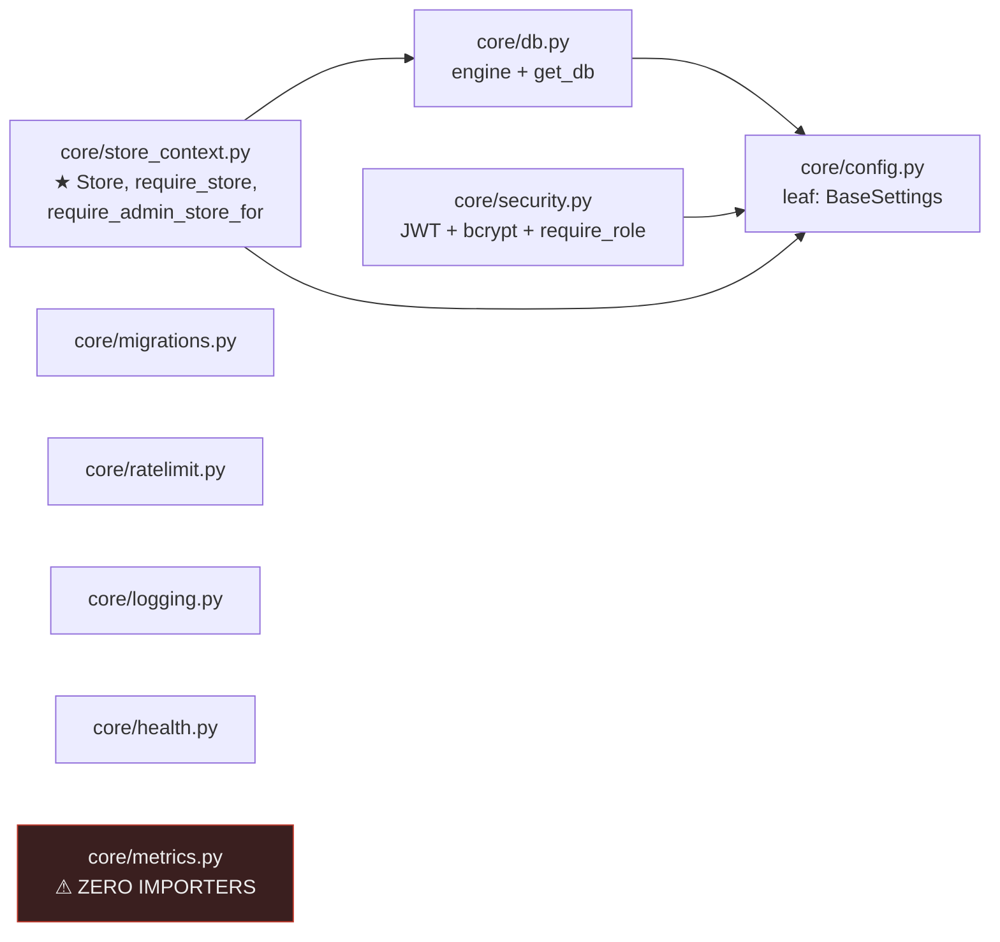
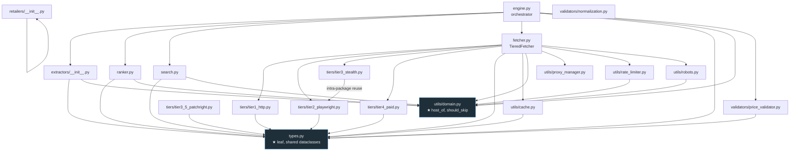
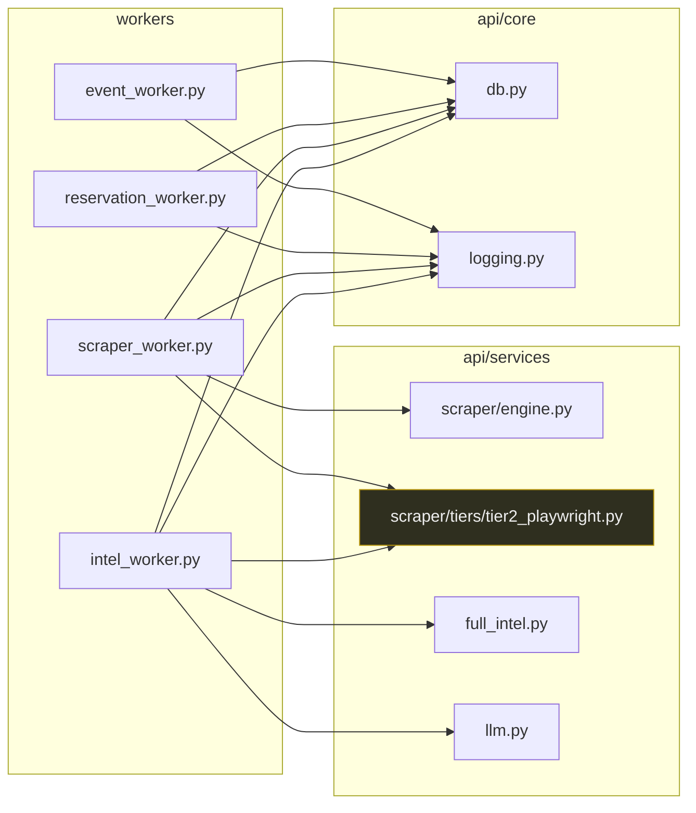
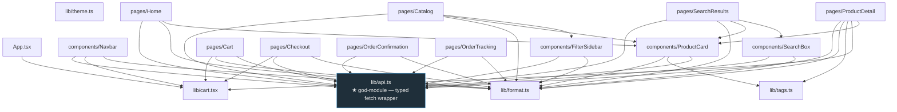

# GLstore — Dependency Graph

**Audit date:** 2026-07-31 · **Branch:** `gaming-store` @ `760b8b7` · **Read-only audit.**
Every edge below was extracted by grepping each file's own `from api...` / `from workers...` / `from '@/...'` import lines — not inferred from behavior. **CONFIRMED** unless marked otherwise.

---

## 1. Backend — `api/core` layer (the foundation everything sits on)

`config.py` is the only true leaf. `db.py`, `security.py`, `store_ctx.py` each depend only on `config.py` (+ `db.py` for `store_ctx.py`) — no cross-talk between `security.py` and `store_context.py`, which is why the two store-resolution paths and the auth/role system compose independently rather than needing each other. `migrations.py`, `ratelimit.py`, `logging.py`, `health.py` are all leaves with no internal imports. `metrics.py` is an isolated leaf with **no inbound edges from anywhere in the graph** — see §5.

## 2. Backend — routes → core/services fan-out

```mermaid
graph TB
    subgraph core["api/core"]
        db[db.py]
        sec[security.py]
        sctx[store_context.py]
        schemas[models/schemas.py]
    end

    subgraph routes["api/routes — 17 files, 16 mounted"]
        auth_r[auth.py]
        catalog_r[catalog.py]
        images_r[images.py]
        products_r[products.py]
        pimport_r[products_import.py]
        penrich_r[enrichment.py]
        intel_r["intel.py ⚠ no store dep"]
        scraper_r["scraper.py ⚠ no store dep"]
        issues_r[issues.py]
        jobs_r["jobs.py ⚠ no store dep"]
        orders_r[orders.py]
        public_orders_r[public_orders.py]
        events_r[events.py]
        settings_r["settings.py ⚠ no store dep"]
        health_r[health.py]
        stores_r[stores.py]
        pexport_r["products_export.py<br/>⚠ UNMOUNTED"]
    end

    subgraph services["api/services"]
        orders_svc[orders.py]
        events_svc[events.py]
        enrich_svc[enrichment.py]
        enrich_run[enrichment_runner.py]
        llm_svc[llm.py]
        llm_enrich[llm_enrichment.py]
        full_intel[full_intel.py]
        csv_parser[csv_parser.py]
        csv_import[csv_import.py]
        validator[validator.py]
        scraper_eng["services/scraper/* subpackage"]
    end

    auth_r --> db & sec & schemas
    catalog_r --> db & sctx
    images_r --> db & sec & sctx
    images_r -.->|"reaches into pipeline internals"| full_intel
    products_r --> db & sec & sctx & schemas
    pimport_r --> db & sec & sctx
    pimport_r --> csv_import & csv_parser & enrich_run
    penrich_r --> db & sec & sctx
    penrich_r --> enrich_run & llm_svc & llm_enrich
    intel_r --> db & sec
    scraper_r --> db & sec
    issues_r --> db & sec & sctx
    issues_r --> validator & enrich_svc
    jobs_r --> db & sec
    orders_r --> db & sec & sctx & schemas
    orders_r --> orders_svc
    public_orders_r --> db & sctx
    events_r --> db & sec & sctx & schemas
    settings_r --> db & sec
    settings_r --> llm_svc
    health_r --> db & sec
    stores_r --> db & sec
    pexport_r --> db & sec

    orders_svc --> sctx & schemas & events_svc
    enrich_run --> enrich_svc
    llm_enrich --> llm_svc
    full_intel --> llm_svc & scraper_eng
    csv_import --> csv_parser
    validator --> enrich_svc

    classDef unscoped fill:#3a2f1f,stroke:#d68910,color:#eee
    classDef dead fill:#3a1f1f,stroke:#c0392b,color:#eee
    class intel_r,scraper_r,jobs_r,settings_r unscoped
    class pexport_r dead
```

**Layering check — CONFIRMED clean on the primary axis:** grepped every file in `api/routes/` and `api/services/` for `from api.routes` / `import api.routes`. **Zero matches in either direction.** No route imports another route; no service imports a route. The "routes thin, services fat, services never import routes" rule is upheld with no exceptions found.

**One soft violation:** `api/routes/images.py:29` imports `api.services.full_intel._recompute_status_and_completeness` — a private-by-convention helper (leading underscore) from a service module that otherwise belongs to the intel pipeline, not the image-review feature. Not a layering-direction violation (route→service is correct direction), but it's a route reaching past the service's public surface into an internal helper — a coupling smell worth flagging.

## 3. Backend — `api/services/scraper/` internal subgraph

**No circular imports found** — exhaustive: every `from api.services.scraper...` import line in all 30 files under `api/services/scraper/` was collected and none forms a cycle. `types.py` and `utils/domain.py` are the two intra-package god-modules (imported by ~10 and ~6 sibling files respectively) — this is expected and benign for a shared-vocabulary/leaf module, not a risk.

One notable internal reuse: `tiers/tier3_stealth.py` imports a private function `_fetch_inner` directly from `tiers/tier2_playwright.py` rather than going through `fetcher.py` — a sibling-tier reaching into another sibling-tier's internals. Not circular (tier2 doesn't import tier3 back), but it's the one place in the scraper subpackage where a "tier" module depends on another "tier" module instead of only on `types.py`.

## 4. Workers → services (the only inbound edge class workers have)

**CONFIRMED — zero worker-to-worker imports.** Every `workers/*.py` file's own `__init__.py` is empty and none imports a sibling worker module. Coordination is exclusively through DB row claims (`FOR UPDATE SKIP LOCKED`).

**Layering nuance:** `scraper_worker.py` and `intel_worker.py` both import `api.services.scraper.tiers.tier2_playwright` **directly** (not through `engine.py`) — solely to call `tier2_playwright.shutdown()` for Playwright/Chromium cleanup on worker exit. This reaches two package levels past the documented "workers call `api/services/*`" boundary (worker → service → **tier submodule**, skipping the engine). It's a narrow, single-purpose reach (lifecycle cleanup only, not business logic), but it's the one place a worker's import graph goes deeper than the service package's own public surface (`engine.py`).

## 5. God-modules — ranked by inbound edge count (backend)

| Module | Inbound importers (files) | Role |
|---|---|---|
| `api/core/db.py` | **25** | async engine + `get_db()` — every route, `store_context.py`, and all 4 workers |
| `api/core/security.py` | **15** | JWT/bcrypt/`require_role` — every route except `catalog.py`, `public_orders.py` |
| `api/core/store_context.py` | **13** | tenancy boundary — `main.py` + 10 routes + 2 services |
| `api/services/scraper/types.py` | ~10 (intra-scraper) | shared scraper dataclasses |
| `api/services/scraper/utils/domain.py` | ~6 (intra-scraper) | `host_of`/`should_skip` URL classification |
| `api/models/schemas.py` | 5 | Pydantic DTOs — **narrower reach than expected**; most routes build response shapes ad hoc rather than through shared schemas |
| `api/core/metrics.py` | **0** | dead — see §1 and Repository_Map.md §7 |

A change to `core/db.py` or `core/security.py` has the widest blast radius in the backend by a wide margin — any signature change ripples to essentially every route file.

---

## 6. Frontend — `storefront/src`

Every page and most components import `lib/api.ts` — it is the storefront's god-module (fan-in from 8 of 9 pages + 3 of 8 components). `main.tsx` also imports `lib/theme.ts` directly for pre-render theme bootstrap. **All 9 pages under `App.tsx`'s lazy-load list have a matching `<Route>`** — no orphaned page files.

## 7. Frontend — `admin/src`

```mermaid
graph TB
    api_ts2["lib/api.ts<br/>★★ 827 lines — largest single frontend file,<br/>heaviest god-module in the repo"]
    auth[lib/auth.tsx]
    store[lib/store.tsx]
    theme2[lib/theme.ts]
    utils2[lib/utils.ts]

    App2[App.tsx]
    Layout[components/Layout]
    IssuePanel[components/IssuePanel]
    ThemeSwitcher[components/ThemeSwitcher]

    Dashboard[pages/Dashboard]
    Products[pages/Products]
    ProductDetail2[pages/ProductDetail]
    ProductEditor[pages/ProductEditor]
    ProductImport[pages/ProductImport]
    IssueExplorer[pages/IssueExplorer]
    Settings2[pages/Settings]
    ThemeStudio[pages/ThemeStudio]
    JobsConsole[pages/JobsConsole]
    CatalogGraph[pages/CatalogGraph]
    Orders2[pages/Orders]
    OrderDetail2[pages/OrderDetail]
    ImageReview[pages/ImageReview]
    Login[pages/Login]

    App2 --> auth & store & api_ts2 & theme2
    Layout --> utils2 & auth & store
    ThemeSwitcher --> api_ts2 & theme2
    IssuePanel --> api_ts2
    store --> api_ts2

    Dashboard --> api_ts2 & utils2
    Products --> api_ts2 & utils2
    ProductDetail2 --> api_ts2 & utils2 & IssuePanel
    ProductEditor --> api_ts2
    ProductImport --> api_ts2 & utils2
    IssueExplorer --> api_ts2 & utils2
    Settings2 --> api_ts2 & theme2
    ThemeStudio --> api_ts2 & theme2
    JobsConsole --> api_ts2 & utils2
    CatalogGraph --> api_ts2 & utils2
    Orders2 --> api_ts2 & utils2
    OrderDetail2 --> api_ts2 & utils2
    ImageReview --> api_ts2 & utils2
    Login --> auth

    classDef godmod fill:#1f2f3a,stroke:#2980b9,color:#eee
    class api_ts2 godmod
```

**All 13 of 14 pages import `lib/api.ts`** (only `Login.tsx` doesn't — it goes through `lib/auth.tsx` instead). This is the single heaviest god-module in either frontend by both fan-in and raw size (827 lines — 3.4× `storefront/src/lib/api.ts`'s 240). `lib/store.tsx` also depends on it, meaning the store-picker itself is coupled to the same file every page reads/writes through. Any shape drift in `admin/src/lib/api.ts` (hand-written, no codegen, per CLAUDE.md §5/Architecture.md §2) has the widest blast radius of any single frontend file in the repo.

---

## 8. Cross-cutting summary

| Question | Answer |
|---|---|
| Circular imports (backend)? | **None found**, in `api/core`, `api/routes`, `api/services` (incl. `scraper/` subpackage), or `workers/` |
| Circular imports (frontend)? | **None found** in either `storefront/src` or `admin/src` `@/` import graphs |
| Route imports route? | **Zero** — verified by direct grep, both directions |
| Service imports route? | **Zero** |
| Worker imports worker? | **Zero** — DB-row coordination only |
| Layering deviations (not violations, but noteworthy) | (1) `routes/images.py` reaches into `full_intel`'s private `_recompute_status_and_completeness`; (2) `scraper_worker.py`/`intel_worker.py` import `scraper/tiers/tier2_playwright` directly instead of going through `engine.py`; (3) `tiers/tier3_stealth.py` imports a private helper from sibling `tiers/tier2_playwright.py` |
| God-modules (backend) | `core/db.py` (25 importers), `core/security.py` (15), `core/store_context.py` (13) |
| God-modules (frontend) | `admin/src/lib/api.ts` (13 of 14 pages, 827 lines), `storefront/src/lib/api.ts` (8 of 9 pages, 240 lines) |
| Dead module in the graph | `api/core/metrics.py` — 0 inbound edges, isolated node |

---

*Prepared as part of a three-file repository-intelligence audit. Companion files: `audit/Repository_Map.md`, `audit/Feature_Map.md`.*
